<p align="center">
  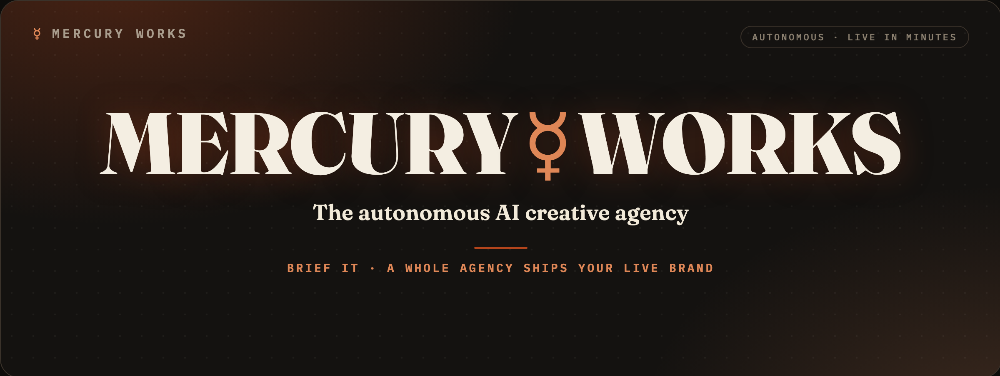
</p>

<p align="center"><b>An AI creative agency with no humans in it. It has shipped 11 real, live brand sites — and it's open source.</b></p>

<p align="center">
  <a href="#the-shipping-record"></a>
  
  
  <a href="https://github.com/NousResearch/hermes"></a>
  <a href="LICENSE"></a>
</p>

> **This is a working system, not a mockup.** Every site below was researched, named, designed, illustrated, voiced, and **deployed** by AI agents — end to end, zero human edits. Click any of them. They're live right now.

## The shipping record

Eleven briefs in, eleven brands out. Each screenshot links to the **live** site — the one-line brief it was born from is underneath.

<table>
  <tr>
    <td align="center" width="33%">
      <a href="https://night-buff-jd7d8c.mw-mc-preview.pages.dev">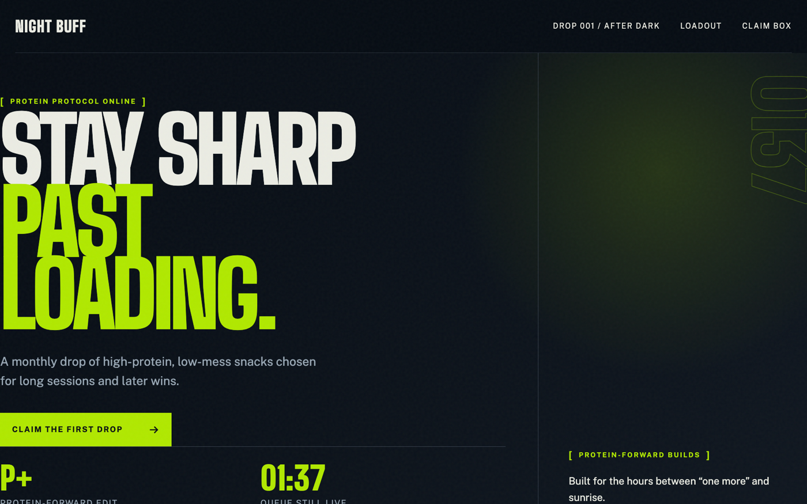</a><br>
      <b>Night Buff</b><br><sub>“a protein-forward late-night snack box for gamers”</sub>
    </td>
    <td align="center" width="33%">
      <a href="https://pacekind-26cf09.mw-waitlist.pages.dev">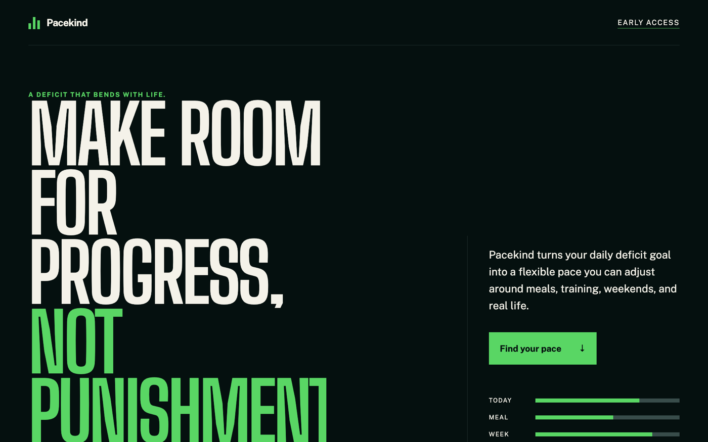</a><br>
      <b>Pacekind</b><br><sub>“a fitness brand for reaching daily deficit goals”</sub>
    </td>
    <td align="center" width="33%">
      <a href="https://mw-mooncommit-2aaaa2.pages.dev">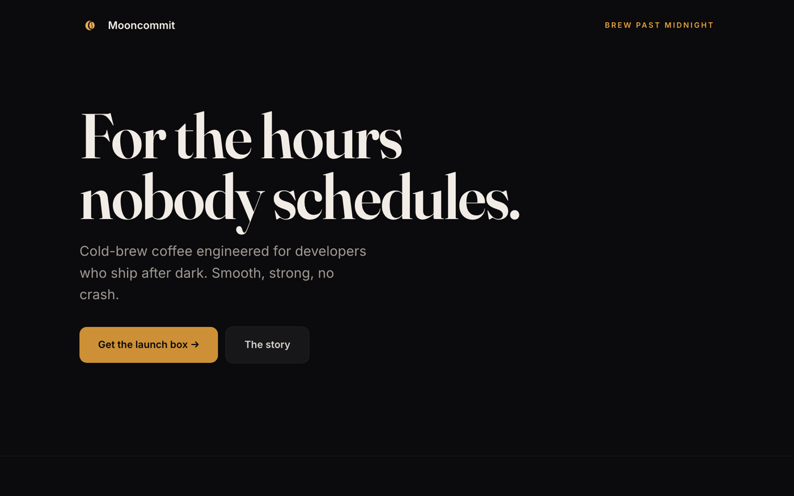</a><br>
      <b>Mooncommit</b><br><sub>“a cold-brew coffee for developers who code at night”</sub>
    </td>
  </tr>
  <tr>
    <td align="center" width="33%">
      <a href="https://mw-notyetworn-a73bbf.pages.dev">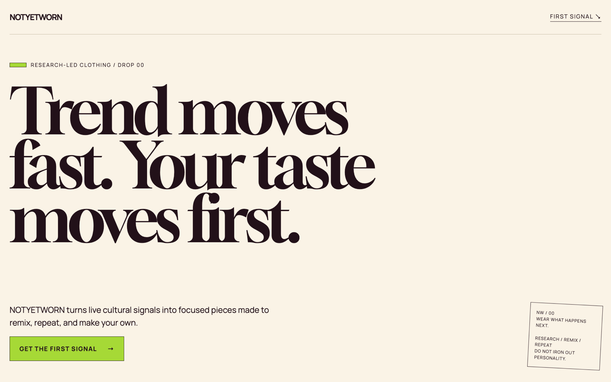</a><br>
      <b>Not Yet Worn</b><br><sub>“a considered clothing brand” · generated hero shot</sub>
    </td>
    <td align="center" width="33%">
      <a href="https://mw-offsheet-9301cc.pages.dev">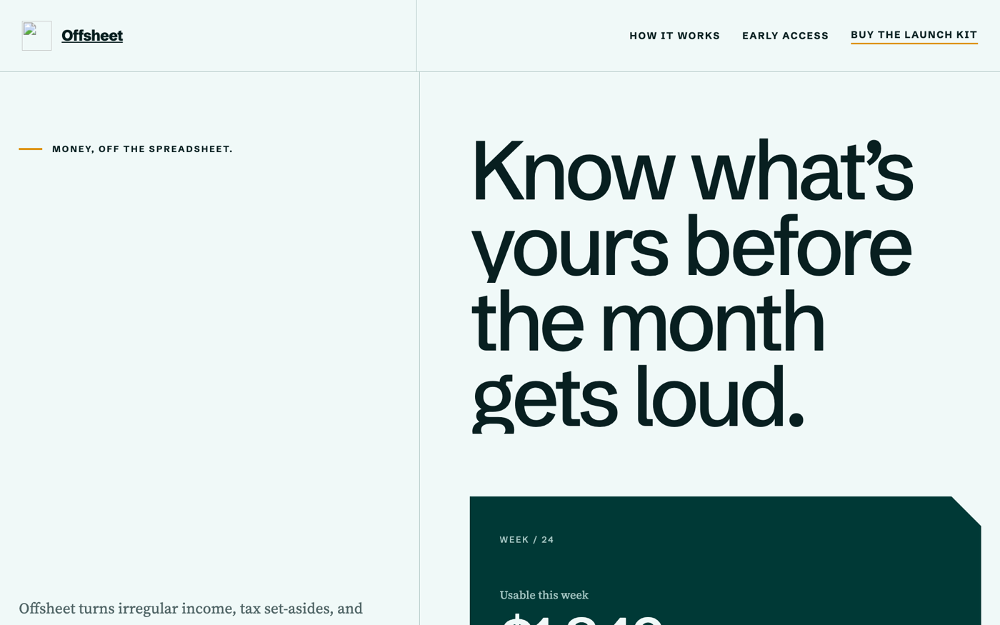</a><br>
      <b>Offsheet</b><br><sub>“a minimalist finance app for freelancers”</sub>
    </td>
    <td align="center" width="33%">
      <a href="https://mw-dayheld-5e5db8.pages.dev">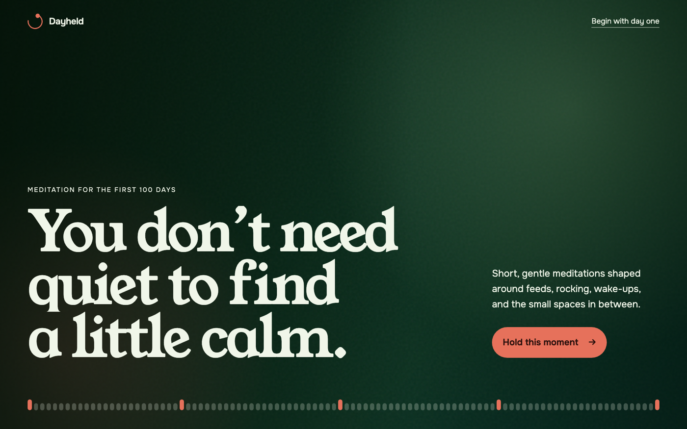</a><br>
      <b>Dayheld</b><br><sub>“a calm meditation app for new parents”</sub>
    </td>
  </tr>
  <tr>
    <td align="center" width="33%">
      <a href="https://mw-tessiq-2a3778.pages.dev">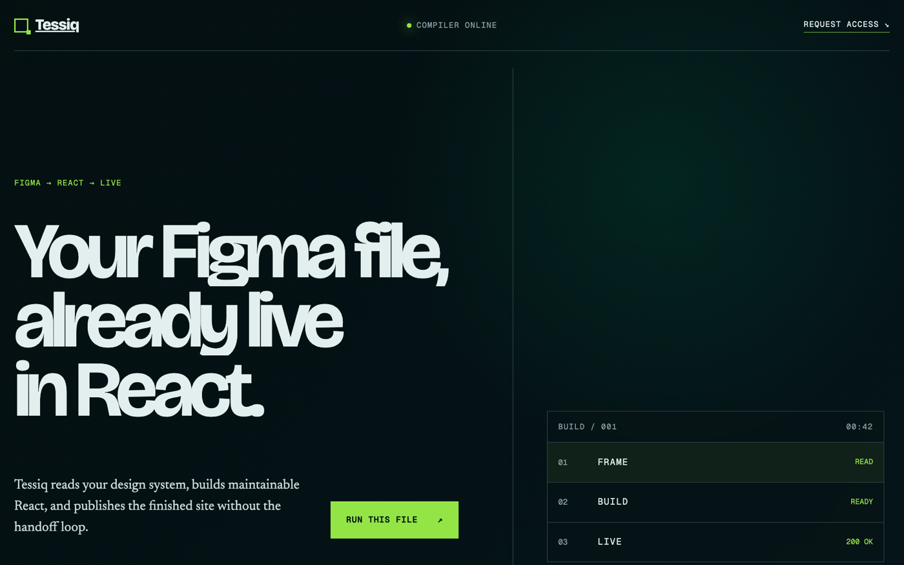</a><br>
      <b>Tessiq</b><br><sub>“a no-code tool that turns Figma files into live React”</sub>
    </td>
    <td align="center" width="33%">
      <a href="https://mw-by-dusk-707099.pages.dev">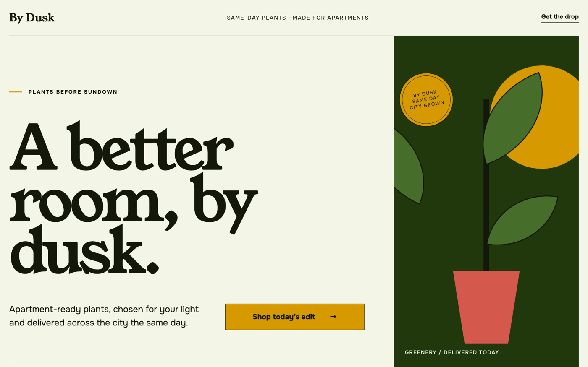</a><br>
      <b>By Dusk</b><br><sub>“same-day indoor-plant delivery for apartments”</sub>
    </td>
    <td align="center" width="33%">
      <a href="https://mw-veilcount-2523c1.pages.dev">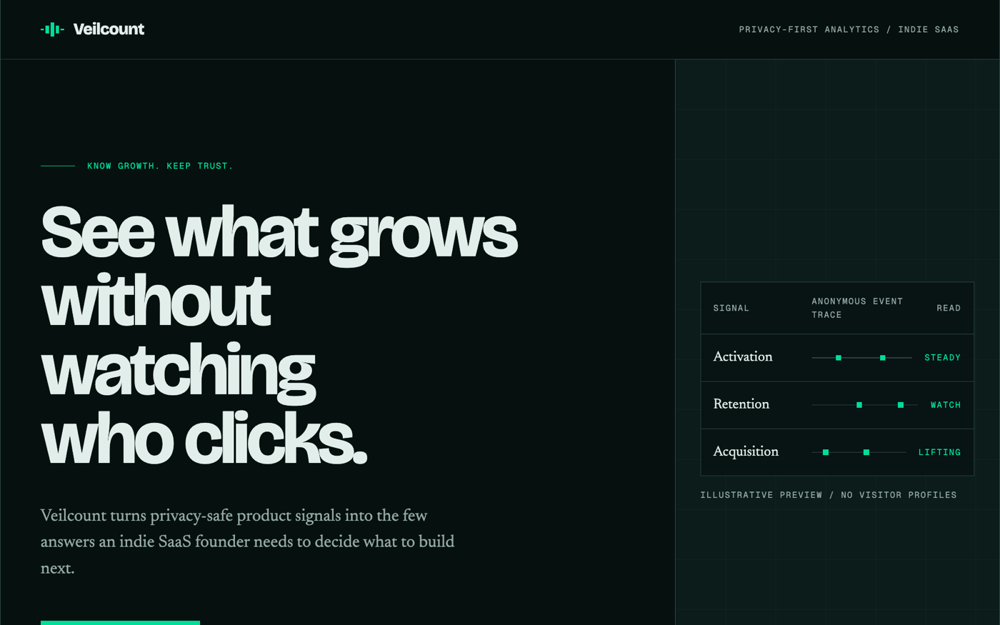</a><br>
      <b>Veilcount</b><br><sub>“privacy-first analytics for indie SaaS founders”</sub>
    </td>
  </tr>
  <tr>
    <td align="center" width="33%">
      <a href="https://mw-make-at-once-a6442c.pages.dev">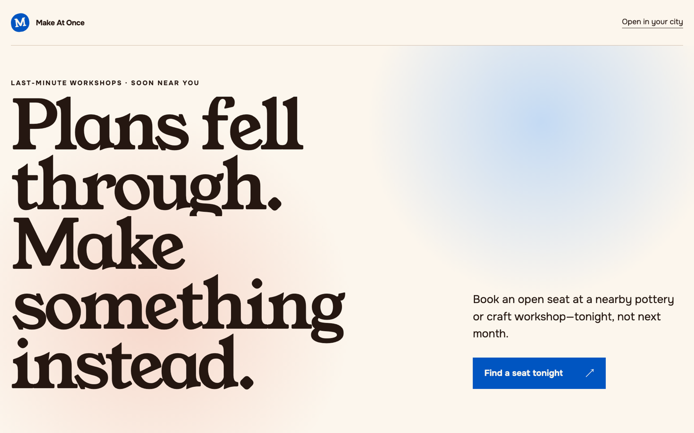</a><br>
      <b>Make at Once</b><br><sub>“last-minute pottery & craft workshop booking”</sub>
    </td>
    <td align="center" width="33%">
      <a href="https://mw-launch-at-eek3-college-980c43.pages.dev">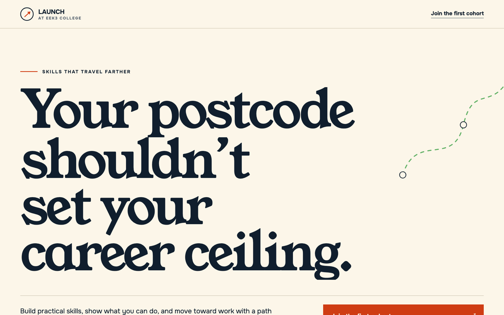</a><br>
      <b>eek3 College</b><br><sub>“career upskilling for tier-3 students”</sub>
    </td>
    <td align="center" width="33%" valign="middle">
      <sub><b>#12 is in the queue.</b><br>Scan the QR on <a href="https://mercury-mission-control.pages.dev">Mission Control</a> and give it a sentence.</sub>
    </td>
  </tr>
</table>

## How it works

**1 — You write one sentence.** Scan a QR, type a brief — *“a cold-brew coffee for developers who code at night.”* That's the last thing a human does.

**2 — The agency staffs itself.** A **Managing Director** agent hires from a live org roster — researcher, namer, designer, illustrator, voice artist — and **spawns new roles mid-run** when the brief demands it (a *Compliance Reviewer* for a regulated product). Every stage animates on a big-screen [Mission Control](https://mercury-mission-control.pages.dev) board.

**3 — A real brand goes live.** Name + tagline (it catches naming clashes and revises), a bespoke landing page (never a template), a generated hero photo, a 30-second radio ad, and a working **Dodo Payments** checkout — deployed to a real `*.pages.dev` URL. Then the agency **writes itself a skill** so the next brief in that vertical ships faster.

It runs **on the [Hermes](https://github.com/NousResearch/hermes) agent** — the product *is* an agent run. Each brief is one `hermes -z` session executing the [`launch-kit` skill](hermes/skills/agency/launch-kit/SKILL.md) with real tools, reporting every stage to Convex, which is what the live board renders. It's a **managed, emergent org**, fully **observable** (a Langfuse trace per run), with a **closed learning loop** (a measured job-2-beats-job-1 delta).

## The control room

Everything above is what the machine ships. This is the machine — **you scan, it ships**, and you get to watch the org think while it works.

<a href="https://mercury-mission-control.pages.dev">
  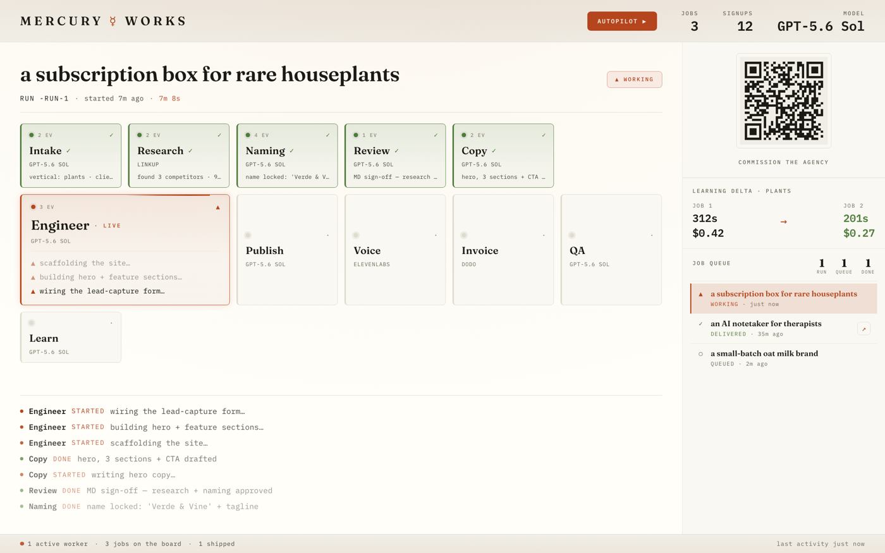
</a>
<p align="center"><sub><b>Mission Control</b> — a run in flight: the DAG animates stage by stage, the queue holds the next brief, and the learning panel proves job 2 beat job 1. The QR in the corner is a real commission button. Put it on the biggest screen you own.</sub></p>

<table>
  <tr>
    <td align="center" width="25%" valign="top">
      <a href="https://mercury-mission-control.pages.dev/?client">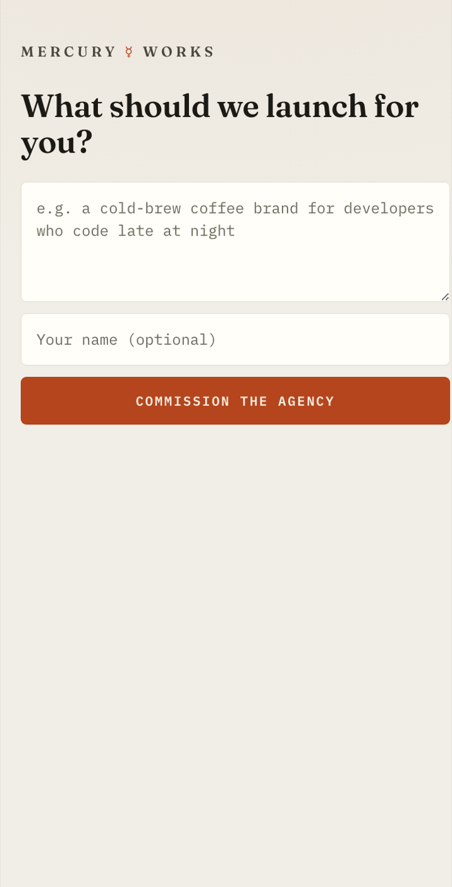</a><br>
      <sub><b>The brief page</b> — scan the QR, type one sentence, tap <i>Commission the agency</i>. That's your whole job.</sub>
    </td>
    <td align="center" width="75%" valign="top">
      <a href="https://mw-waitlist.pages.dev">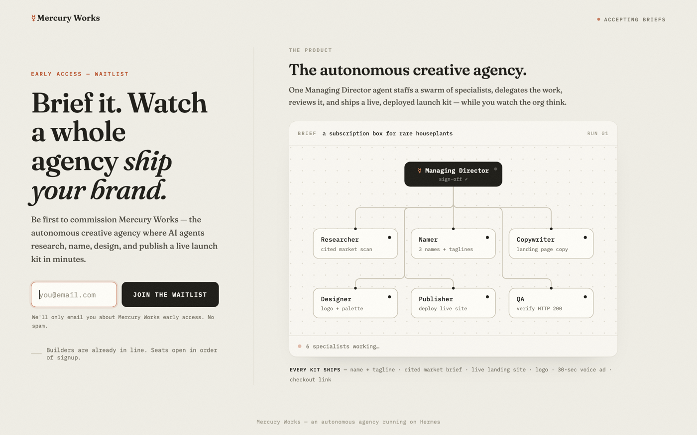</a><br>
      <sub><b>The waitlist</b> — <i>“Brief it. Watch a whole agency ship your brand.”</i> Underneath, the org chart is alive: a Managing Director and six specialists staffing up while you read the headline.</sub>
    </td>
  </tr>
</table>

<sub>There's also an <a href="https://mercury-mission-control.pages.dev/?roster">org roster</a> — where a non-engineer defines a new agent role (mission, allowed tools, guardrails) with no code.</sub>

## Run it yourself

**Prerequisites:** Docker (Rancher Desktop or Docker Desktop), Node 18+, and accounts for: an LLM provider (OpenAI or Google Gemini), [Convex](https://convex.dev), [Cloudflare](https://dash.cloudflare.com) — plus optional [ElevenLabs](https://elevenlabs.io), [Linkup](https://linkup.so), [Dodo Payments](https://dodopayments.com), [Langfuse](https://cloud.langfuse.com).

**1 — Clone + install**
```bash
git clone https://github.com/SuryanshD/mercury-works.git && cd mercury-works
npm install
cp .env.example .env          # fill in your keys
```

**2 — Backend (Convex)**
```bash
npx convex dev                # creates your deployment, generates convex/_generated, prints your URLs
# if using Dodo, set the webhook signing secret ON the deployment (not in .env):
npx convex env set DODO_PAYMENTS_WEBHOOK_KEY whsec_xxx
```
Put the printed `CONVEX_URL` and `CONVEX_REPORT_URL` (`https://<deployment>.convex.site/report`) into `.env`.

**3 — The Hermes agent (Docker)** — this is what actually ships the sites.
```bash
mkdir -p ~/.hermes/skills
cp -r hermes/skills/* ~/.hermes/skills/     # install the agency + design skills
cp .env ~/.hermes/.env                       # the container reads this env-file
```
Create `~/.hermes/config.yaml`:
```yaml
model:
  provider: openai-api        # your provider
  default:  gpt-5.6-sol       # your model
  api_mode: responses         # gpt-5.6-sol needs this for tools + reasoning
plugins:
  - observability/langfuse    # optional — traces every run
```
Build the image (Langfuse SDK baked in) + start the container:
```bash
bash scripts/hermes-up.sh
```
This builds `mercury-hermes` from the [`Dockerfile`](Dockerfile) and runs the `hermes` container with `~/.hermes → /opt/data` mounted on `127.0.0.1:8642`. Each brief then becomes one run:
`docker exec hermes hermes -z "<prompt>" --provider openai-api -m gpt-5.6-sol --yolo`.

**4 — The worker (the bridge)**
```bash
node worker/index.mjs          # polls Convex for queued jobs → drives Hermes → streams events back
```

**5 — The frontend (Mission Control + client page)**
```bash
npm run build
npx wrangler pages deploy dist --project-name=<your-project>
```
Open the deployed URL on a screen, scan the QR with your phone, type a brief, and watch the agency ship it.

> Verify every provider key in one shot: `bash scripts/smoke-test.sh`

## Under the hood

```
 phone / QR ──▶ Client page ──▶ Convex (queue)  ◀── Mission Control (live board, reactive)
                                     │
                                     ▼
                          worker/index.mjs   (local Node poller — outbound only)
                                     │  docker exec hermes hermes -z "<brief>" --yolo
                                     ▼
                          Hermes agent   (Docker)  ── runs the launch-kit skill
                                     │  research → name → design → images → voice → checkout → deploy → learn
                                     ▼
              real *.pages.dev site (Cloudflare)  +  events streamed back to Convex → the DAG animates
```

- **Hermes is the base harness** — no tunnel, no VPS; the worker only makes outbound connections and Hermes runs locally in Docker.
- **Provider-agnostic** — the model provider is one value in `.env` (built on Gemini, ran on `gpt-5.6-sol`).
- **Emergent org + learning loop + observability** — roles are spawned per brief, each run writes a reusable skill, and every run traces to Langfuse.

<details>
<summary><b>Payments</b></summary>

Checkout uses a **static Dodo product link** (`checkout.dodopayments.com/buy/<product>`) — it **never expires** and mints a fresh session on every click, carrying `metadata_job_id` so the webhook flips the job to **PAID** on the board. The link forces USD so the standard test card (`4242 4242 4242 4242`, exp `06/32`, CVV `123`) always clears. This holds for every generated site and every future build.
</details>

<details>
<summary><b>Repo layout</b></summary>

```
convex/     backend spine — schema, FIFO queue, mutations, httpActions (/report, /dodo-webhook, /lead, /roles)
worker/     local Node poller → drives Hermes via docker exec (outbound-only bridge)
hermes/     the agent's skills — launch-kit (SKILL.md + scripts + template) + design (web-design, web-motion)
src/        Mission Control (live board + DAG) · Client brief page · Roster management UI
waitlist/   standalone waitlist landing page
scripts/    hermes-up.sh (build + run the container) · smoke-test.sh (verify providers)
Dockerfile  Hermes runtime + Langfuse SDK
```
</details>

## Powered by

OpenAI (`gpt-5.6-sol` + `gpt-image-1`) · Nous Research **Hermes** · Convex · Cloudflare Pages · ElevenLabs · Linkup · Dodo Payments · Langfuse

---

## If this made you look twice

- ⭐ **Star the repo** — it's how the next person finds out AI agents can *ship*, not just chat.
- 🚀 **[Run it yourself](#run-it-yourself)** — your sentence, a live brand, in minutes.
- 👋 **Say hi** — built by **Suryansh Deoli** ([@SuryanshD](https://github.com/SuryanshD)) & **Piyush Rane** ([@PiyushRane](https://github.com/PiyushRane)) at the GrowthX × Nous Hermes Buildathon. Brand #12 is already in the queue.

**License:** [MIT](LICENSE) © Suryansh Deoli & Piyush Rane
